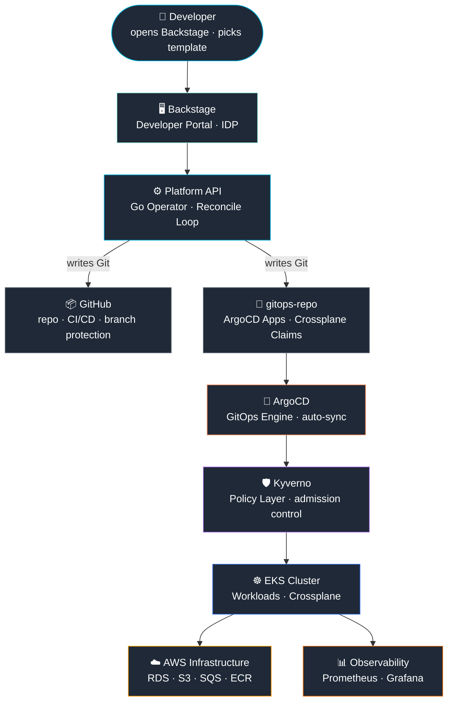
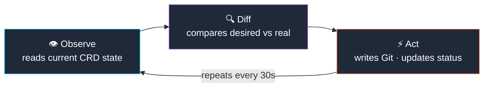
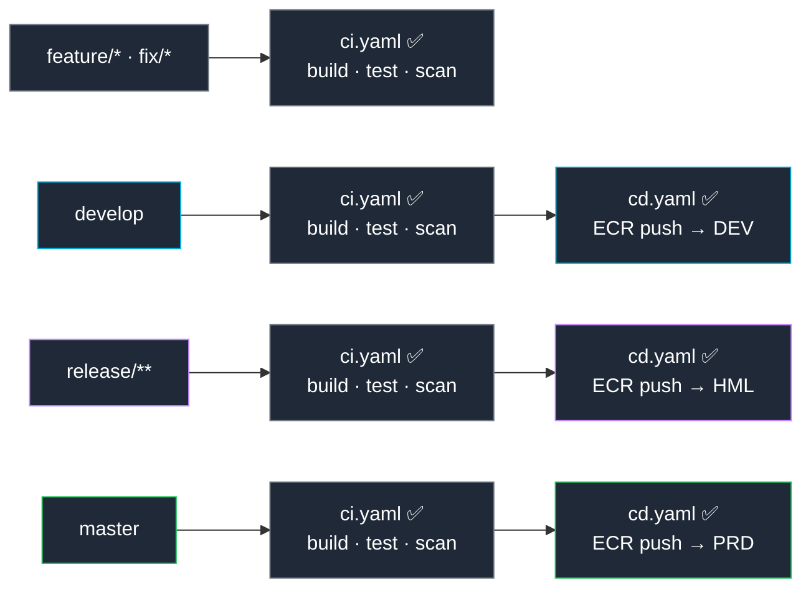

# Platform Engineering Reference Architecture


> **Production-grade Internal Developer Platform (IDP)** built on Kubernetes, following the same architecture principles used by Spotify, Netflix, Mercado Livre and Uber.

A developer requests a new service → the platform provisions the repository, CI/CD, infrastructure and deployment automatically. No tickets. No AWS console access. No manual configuration.

```
Developer fills a form in Backstage
  → Platform API (Go Operator) reconciles desired state
  → GitHub repo + ArgoCD Applications + Crossplane Claims created
  → ArgoCD deploys to EKS · Crossplane provisions RDS/S3/SQS on AWS
  → Developer gets a running service in minutes
```

---

## Documentation

| Document | Description |
|---|---|
| [Architecture Overview](docs/architecture.md) | Architectural layers, design decisions, infrastructure layout |
| [Control Plane Design](docs/control-plane.md) | Platform API deep-dive: Operator pattern, CRDs, GitHub App auth |
| [Developer Workflow](docs/developer-workflow.md) | End-to-end journey from service creation to production deploy |
| [Platform Components](docs/platform-components.md) | Each component: role, design rationale, integration points |
| [Architecture Principles](ARCHITECTURE.md) | Design principles + ADR index |
| [ADR 001 — Control Plane](docs/adr/001-control-plane-architecture.md) | Why Kubernetes Operator over plain REST API |
| [ADR 002 — GitOps / ArgoCD](docs/adr/002-gitops-with-argocd.md) | Why ArgoCD with ApplicationSets |
| [ADR 003 — Crossplane](docs/adr/003-infrastructure-with-crossplane.md) | Why Crossplane over Terraform for runtime infra |

---

## Architecture — Golden Triangle + Platform API



**Four pillars:**
- **Backstage** — self-service portal (developer never accesses AWS directly)
- **GitHub** — single source of truth (all state lives in Git)
- **Platform API (Go Operator)** — receives request, writes manifest to Git, reconciles state
- **ArgoCD** — GitOps engine (what is in Git is what runs in the cluster)

---

## Tech Stack

| Layer | Technology | Why |
|---|---|---|
| **IDP** | Backstage | Industry standard, created by Spotify, used by 3000+ companies |
| **Platform API** | Go + controller-runtime | Operator pattern — continuously reconciles desired vs real state |
| **GitOps** | ArgoCD | Declarative Git→EKS sync with automatic audit trail |
| **Cloud IaC** | Crossplane 2.0 | Infrastructure as Kubernetes CRDs — same API for apps and infra |
| **Base IaC** | Terraform | Provisions EKS, VPC, Route53, cert-manager |
| **CI/CD** | GitHub Actions + OIDC | Zero static credentials, temporary role via AWS STS |
| **Auth** | GitHub App (JWT + OAuth) | Single App for catalog, login and Platform API. Zero PAT. |
| **Guardrails** | Kyverno | Policy as code enforced at admission webhook |
| **Observability** | Prometheus + Grafana | CNCF standard stack |
| **DNS + TLS** | Route53 + cert-manager + Let's Encrypt | Automatic TLS, zero manual configuration |
| **Runtime** | EKS 1.31 + SPOT | Cost-optimized for lab (~$0.30/hr) |

---

## Platform API — Go Operator Pattern

The layer that differentiates this from a simple GitOps architecture.
Based on the same pattern used internally at **Uber, Cloudflare and HashiCorp**.

### Why Operator pattern instead of a plain REST API?

| Approach | Limitation |
|---|---|
| Plain REST API | Stateless — does not know if the resource was actually created |
| Pure GitOps broker | Writes to Git but does not validate final state |
| **Operator (controller-runtime)** | **Continuously reconciles — guarantees desired state == real state** |

### Reconciliation cycle (Kubernetes pattern)



### Who uses this pattern in production

| Company | Project | What it does |
|---|---|---|
| **HashiCorp** | Vault Operator | Reconciles Secrets between Vault and K8s |
| **Crossplane** | All Providers | Reconciles Claims → AWS resources |
| **Cloudflare** | Internal Operators | Manages DNS and Workers via CRD |
| **Uber** | uDeploy internals | Reconciles deployment state |

---

## GitFlow — Deployment rules per branch

Every service created by Backstage gets two separate workflows:

| File | Branch | What it does |
|---|---|---|
| `ci.yaml` | **every branch** | build + test + quality scan — never deploys |
| `cd.yaml` | `develop`, `release/**`, `master` | push ECR + updates gitops-repo |



---

## What you can do with the lab running

| Capability | How |
|---|---|
| Create a new service (Java or Python) | Backstage template → fills form → repo + CI/CD + ArgoCD created automatically |
| Provision AWS infrastructure | Request RDS/S3/SQS via Crossplane Claim → connection string auto-injected into K8s Secret |
| View all services and their state | ArgoCD dashboard → sync status, diff, rollback |
| Deploy without static AWS credentials | GitHub Actions OIDC → temporary STS role per environment |
| Enforce platform standards automatically | Kyverno blocks deploy without resource limits, health probes or versioned tags |
| Monitor platform operations | Grafana dashboard → Platform API metrics + application metrics |

---

## Guardrails — Automatic enforcement

Any deploy that does not meet platform standards is **automatically blocked**:

| Policy | Enforcement |
|---|---|
| Required labels (app / owner / team) | Hard block — deploy rejected |
| Required resource limits (cpu/memory) | Hard block — no limits, no deploy |
| No `:latest` image tag | Hard block — versioning enforced |
| Health probes (liveness + readiness) | Audit — compliance visibility |

---

## Project Structure

```
platform-engineering-reference/
├── setup.sh                  ← auto-detects AWS/GitHub, zero interaction with .env.secrets
├── deploy.sh                 ← brings up everything in one command (with checkpoint/resume)
├── destroy.sh                ← tears down everything in correct AWS dependency order
├── .env.secrets.example      ← GitHub App credentials template
│
├── infra/                    ← base infrastructure (Terraform)
│   ├── 00-backend/           ← S3 state + DynamoDB lock
│   ├── 01-vpc/               ← VPC + subnets
│   ├── 02-eks/               ← EKS cluster
│   ├── 03-networking/        ← NGINX + cert-manager + Route53
│   └── 04-platform/          ← ArgoCD + Backstage + Crossplane + PostgreSQL
│
├── backstage/                ← DevPortal + service templates
│   └── platform-templates/
│       ├── new-service/      ← Java/Spring Boot template (ci.yaml + cd.yaml)
│       └── python-api/       ← Python FastAPI template
│
├── platform-api/             ← Go Operator (controller-runtime)
│   ├── cmd/operator/         ← entry point (REST API + Operator in one process)
│   ├── internal/controller/  ← reconcile loop (PlatformService + InfraRequest)
│   ├── internal/github/      ← GitHub App client (JWT)
│   ├── internal/handlers/    ← REST endpoints for Backstage
│   ├── api/v1alpha1/         ← CRD types
│   ├── config/crd/           ← CRD manifests for EKS
│   └── .github/workflows/
│       └── build-operator.yaml  ← cloud build via GitHub Actions (no local Docker needed)
│
├── crossplane/               ← XRDs + Compositions (RDS, S3, SQS)
├── guardrails/kyverno/       ← 4 security policies
├── gitops/appsets/           ← ArgoCD ApplicationSets (GitFlow: dev/hml/prd)
├── observability/            ← Prometheus + Grafana
└── scripts/
    ├── get-credentials.sh    ← retrieves all passwords and URLs after deploy
    └── deploy-operator.sh    ← manual operator deploy if needed
```

---

## Getting Started

> **Docker is not required** — the Platform Operator is built via GitHub Actions in the cloud.

### Prerequisites

```bash
# Confirm AWS authentication
aws sts get-caller-identity

# Authenticate GitHub CLI
gh auth login
```

### Setup (zero interaction)

```bash
# Fill in GitHub App credentials once
cp .env.secrets.example .env.secrets
chmod 600 .env.secrets
vim .env.secrets   # GITHUB_APP_ID, INSTALLATION_ID, CLIENT_ID, CLIENT_SECRET, PEM_PATH

# Auto-detects everything possible
./setup.sh
# → S3 tfstate, DynamoDB lock, Route53, GitHub Org: auto-detected
# → gitops-repo and platform-templates repos: created automatically
# → terraform.tfvars for all 4 modules: generated
# → AWS Secrets Manager: populated

# Bring up everything
./deploy.sh
```

After deploy completes, all credentials (ArgoCD, Grafana, Platform API token, PostgreSQL) are displayed automatically.

```bash
# Retrieve credentials at any time
./scripts/get-credentials.sh
```

**Estimated time:** ~25–30 minutes (EKS takes ~15 min)
**Estimated cost:** ~$0.30/hour (EKS SPOT t3.medium)

### Teardown — leaves nothing in AWS

```bash
./destroy.sh
# Type DESTROY to confirm
```

Destroys in correct order: Crossplane Claims → ArgoCD Apps → Platform → Networking → EKS → VPC. Nothing is left orphaned.

---

## Roadmap

| Phase | Component | Status |
|---|---|---|
| 1 | Base infra (Terraform: VPC, EKS, NGINX, cert-manager) | ✅ done |
| 1 | Backstage + templates (GitFlow ci.yaml / cd.yaml) | ✅ done |
| 1 | Crossplane XRDs + Compositions (RDS, S3, SQS) | ✅ done |
| 1 | ArgoCD ApplicationSets (dev / hml / prd) | ✅ done |
| 1 | Kyverno guardrails (4 policies) | ✅ done |
| 1 | Observability (Prometheus + Grafana) | ✅ done |
| 2 | Platform API — Go Operator (controller-runtime) | ✅ done |
| 2 | CRDs: PlatformService + InfraRequest | ✅ done |
| 2 | GitFlow (separate ci.yaml / cd.yaml) | ✅ done |
| 2 | Automated setup + credentials scripts | ✅ done |
| 2 | Cloud build without local Docker | ✅ done |
| 3 | AI layer (natural language → Claim) | 🔲 planned |
| 3 | Advanced service maturity scorecard | 🔲 planned |

---

## References

- [Backstage.io](https://backstage.io) — official documentation
- [Crossplane](https://docs.crossplane.io) — declarative cloud infrastructure
- [ArgoCD](https://argo-cd.readthedocs.io) — GitOps engine
- [Kyverno](https://kyverno.io) — Kubernetes policy engine
- [controller-runtime](https://github.com/kubernetes-sigs/controller-runtime) — Go Operator foundation
- [CNCF Landscape](https://landscape.cncf.io) — cloud-native ecosystem map
- [Crossplane & AI: API-First Infrastructure](https://blog.crossplane.io/crossplane-ai-the-case-for-api-first-infrastructure/)
- **Platform Engineering on Kubernetes** — Mauricio Salatino (Manning)
- **Kubernetes Patterns** — Bilgin Ibryam & Roland Huß (O'Reilly)
- **Platform Engineering with Go** — Nels Lutiy (O'Reilly)

---

## Status

🚧 Active reference implementation — currently under local validation, hands-on testing and architectural study.

See [ARCHITECTURE.md](ARCHITECTURE.md) for design principles and [docs/adr/](docs/adr/) for key architectural decisions.

---

## License

MIT © 2026 — see [LICENSE](LICENSE)
