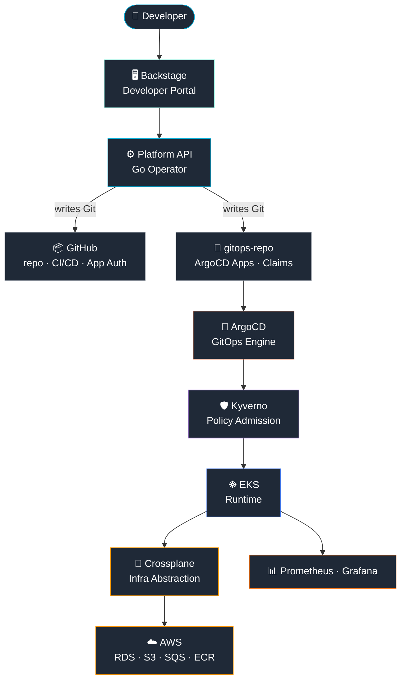

# Architecture Overview

> This document describes the high-level architecture of the Platform Engineering Reference.
> For component-level detail see [platform-components.md](platform-components.md).
> For the developer journey see [developer-workflow.md](developer-workflow.md).

---

## Problem Statement

Traditional software delivery requires developers to:

- Open tickets to request infrastructure (RDS, S3, SQS)
- Configure CI/CD pipelines manually
- Request repository creation and branch protection
- Manage AWS credentials per team

**Result:** weeks of lead time, inconsistent standards, security exposure, high cognitive load for developers.

---

## Solution: Internal Developer Platform

The platform provides a **self-service control plane** where developers interact only with a portal.
Everything below that line is automated, governed and observable.

```
Developer                    Platform                          AWS
───────                      ────────                          ───
Opens Backstage          →   Platform API reconciles       →   EKS runs workloads
Fills service template   →   GitHub repo + CI/CD created   →   RDS/S3/SQS provisioned
Makes a commit           →   ArgoCD syncs automatically    →   Resources updated
                             Kyverno enforces standards
                             Crossplane owns infra state
```

---

## Architectural Layers

### Layer 1 — Developer Interface

| Component | Responsibility |
|---|---|
| **Backstage** | Self-service portal — software catalog, service templates, scorecard |

Developers interact **only** with Backstage. They never touch AWS console, kubectl or Terraform.

---

### Layer 2 — Control Plane

| Component | Responsibility |
|---|---|
| **Platform API (Go Operator)** | Receives intent from Backstage, writes desired state to Git, reconciles continuously |
| **GitHub (via App)** | Stores all state — repos, workflows, branch protection, CODEOWNERS |

The Platform API follows the **Kubernetes Operator pattern** (`controller-runtime`):
- Receives a `PlatformService` CRD → creates repo + ArgoCD Application + Crossplane Claim
- Reconciles every 30s — guarantees desired state == actual state
- Uses GitHub App (JWT) — zero PAT, zero static tokens

See [control-plane.md](control-plane.md) for deep-dive.

---

### Layer 3 — GitOps Engine

| Component | Responsibility |
|---|---|
| **ArgoCD** | Watches `gitops-repo` and syncs state to EKS automatically |
| **ApplicationSets** | One definition → three environments (dev / hml / prd) via GitFlow branch |

Git is the **only source of truth**. No state lives outside Git.

---

### Layer 4 — Policy + Runtime

| Component | Responsibility |
|---|---|
| **Kyverno** | Admission webhook — blocks non-compliant resources at deploy time |
| **EKS 1.31** | Runtime platform for all workloads |
| **cert-manager** | Automatic TLS via Let's Encrypt + Route53 |
| **NGINX Ingress** | Ingress controller with TLS termination |

---

### Layer 5 — Infrastructure Abstraction

| Component | Responsibility |
|---|---|
| **Crossplane 2.0** | Translates Kubernetes Claims → AWS resources (RDS, S3, SQS) |
| **XRDs + Compositions** | Developer requests a `Database` Claim — platform decides the RDS configuration |

Developers never write Terraform. They write a Kubernetes Claim.

---

### Layer 6 — Observability

| Component | Responsibility |
|---|---|
| **Prometheus** | Metrics collection (platform + workloads) |
| **Grafana** | Dashboards — Platform API operations + application metrics |

---

## Architecture Diagram



---

## Key Design Decisions

### Why Go Operator instead of plain REST API?

A REST API processes requests and returns. An Operator continuously reconciles.

If the repo creation fails halfway, the Operator retries on the next cycle.
A REST API would return an error and leave the system in a broken state.

### Why Crossplane instead of Terraform for runtime infra?

Terraform is stateful and external to Kubernetes.
Crossplane runs inside EKS and treats AWS resources as Kubernetes objects — same `kubectl` workflow, same GitOps loop.

### Why GitHub App instead of PATs?

| Credential | Scope | Rotation | Risk |
|---|---|---|---|
| PAT | all repos | manual | high — static, user-bound |
| GitHub App JWT | per-installation | automatic (10min) | low — app-scoped, auditable |

### Why ArgoCD ApplicationSets?

One `ApplicationSet` definition generates three ArgoCD Applications automatically based on GitFlow branch → environment mapping. No duplication.

---

## Infrastructure Layout (AWS)

```
AWS Account
└── VPC (10.0.0.0/16)
    ├── Public Subnets (3 AZs) — NGINX Load Balancer
    └── Private Subnets (3 AZs) — EKS Node Group (SPOT t3.medium)
        ├── namespace: backstage      — Backstage + PostgreSQL
        ├── namespace: platform       — Platform API (Go Operator)
        ├── namespace: argocd         — ArgoCD
        ├── namespace: crossplane-system — Crossplane + AWS Provider
        ├── namespace: kyverno        — Policy Engine
        ├── namespace: monitoring     — Prometheus + Grafana
        └── namespace: cert-manager   — TLS automation
```

Terraform manages: VPC, EKS, IAM, Route53, NGINX, cert-manager, ArgoCD, Backstage, PostgreSQL, Crossplane.
