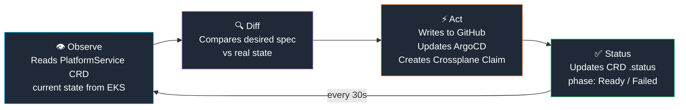

# Control Plane Design — Platform API

> The Platform API is the layer that transforms this from a GitOps setup into a **control plane**.
> It is built in Go using `controller-runtime` — the same library used by Crossplane, Vault Operator and all production Kubernetes operators.

---

## Why a Control Plane?

Without a control plane, Backstage would write directly to GitHub and ArgoCD.
That creates point-to-point integrations, no audit trail, and no reconciliation.

```
Without control plane:
  Backstage → GitHub (direct)
  Backstage → ArgoCD (direct)
  Backstage → AWS (via Terraform/manual)
  → no single source of truth for "what was requested"
  → no reconciliation if something fails
  → audit: impossible

With Platform API:
  Backstage → Platform API (one endpoint)
  Platform API → writes PlatformService CRD to EKS
  Operator reconciles → GitHub + ArgoCD + Crossplane
  → full audit trail in CRD status
  → automatic retry on failure
  → observable via kubectl / Grafana
```

---

## Operator Pattern — Reconciliation Loop

The Platform API follows the **level-triggered** reconciliation model from Kubernetes:



This means: if GitHub repo creation fails, the operator retries on the next cycle.
The system **self-heals** without developer intervention.

---

## Custom Resource Definitions (CRDs)

### PlatformService

Represents a service request from Backstage:

```yaml
apiVersion: platform.devopstia.com/v1alpha1
kind: PlatformService
metadata:
  name: payment-service
  namespace: platform
spec:
  serviceName: payment-service
  language: java
  owner: team-payments
  infraRequested:
    - type: database
      engine: postgres
    - type: queue
      engine: sqs
status:
  phase: Ready
  repoURL: https://github.com/org/payment-service
  argoAppName: payment-service-dev
  conditions:
    - type: RepoCreated
      status: "True"
    - type: ArgoCDRegistered
      status: "True"
    - type: InfraProvisioned
      status: "True"
```

### InfraRequest

Represents an infrastructure provisioning request:

```yaml
apiVersion: platform.devopstia.com/v1alpha1
kind: InfraRequest
metadata:
  name: payment-service-db
  namespace: platform
spec:
  serviceName: payment-service
  type: database
  engine: postgres
  size: small
status:
  phase: Provisioned
  connectionSecretRef: payment-service-db-conn
```

---

## GitHub App Authentication

The operator authenticates to GitHub using a **GitHub App JWT**, not a PAT.

```
1. Operator reads PEM key from K8s Secret (injected from AWS Secrets Manager)
2. Signs JWT with RS256 (10-minute expiry)
3. Exchanges JWT for Installation Token (per-org, per-repo scoped)
4. Uses Installation Token for API calls
5. Token expires automatically — zero rotation needed
```

Benefits over PAT:
- Scoped to specific repositories and permissions
- Auto-expiring tokens — no rotation burden
- Audit log shows App name, not user name
- Works with GitHub Enterprise and OIDC policies

---

## What the Operator Does

When a `PlatformService` is created:

```
1. Creates GitHub repository
   └── sets description, visibility, default branch

2. Applies branch protection rules
   └── require PR review, status checks, no force-push to master/develop

3. Creates CODEOWNERS file
   └── assigns team as code owner

4. Pushes CI/CD workflows
   └── ci.yaml (every branch) + cd.yaml (develop/release/master only)

5. Creates ArgoCD Application via gitops-repo
   └── ApplicationSet generates dev/hml/prd apps automatically

6. Creates Crossplane Claims (if infra requested)
   └── Database Claim → RDS PostgreSQL
   └── Queue Claim → SQS
   └── Bucket Claim → S3

7. Updates PlatformService .status
   └── phase: Ready
   └── all resource refs populated
```

---

## Reconciliation State Machine

```
PlatformService created
        ↓
   phase: Pending
        ↓
   Repo created? ─── No ──→ Requeue (30s)
        ↓ Yes
   ArgoCD registered? ── No ──→ Requeue
        ↓ Yes
   Infra claimed? ── No ──→ Requeue
        ↓ Yes
   phase: Ready
```

---

## API Endpoints (REST layer)

The Platform API also exposes REST endpoints consumed by the Backstage plugin:

| Method | Path | Description |
|---|---|---|
| `POST` | `/api/v1/services` | Create new service (triggers reconciliation) |
| `GET` | `/api/v1/services` | List all PlatformService CRDs |
| `GET` | `/api/v1/services/:name` | Get service status |
| `DELETE` | `/api/v1/services/:name` | Teardown service + infra |
| `POST` | `/api/v1/infra` | Request additional infrastructure |
| `GET` | `/api/v1/infra/:name` | Get InfraRequest status |

Authentication: Bearer token (injected as K8s Secret, rotated via AWS Secrets Manager).

---

## Production References

This pattern is used in production by:

| Company | Project |
|---|---|
| **HashiCorp** | Vault Secrets Operator — reconciles Vault → K8s Secrets |
| **Crossplane** | All cloud providers — reconciles Claims → AWS/GCP/Azure |
| **Cloudflare** | Internal operators — DNS and Workers as CRDs |
| **Weaveworks** | Flux — reconciles Git → Kubernetes |
| **Argo Project** | ArgoCD itself — reconciles Git → cluster state |
