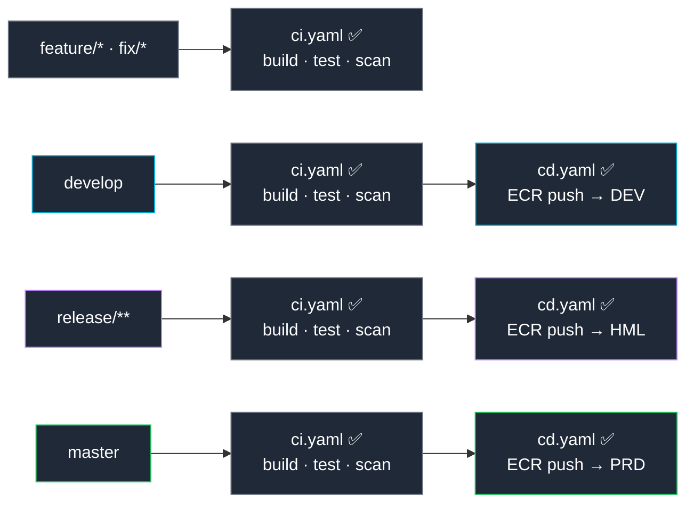

# Developer Workflow

> End-to-end journey: from service creation to production deployment.
> The developer never touches AWS, kubectl, Terraform or CI/CD configuration.

---

## The Golden Path

```
1. Developer opens Backstage and picks a template
2. Platform creates the repository, CI/CD and GitOps config automatically
3. Developer clones the repo and writes business logic
4. Every commit triggers CI automatically
5. Merge to develop → automatic deploy to DEV
6. Merge to release/* → automatic deploy to HML
7. Merge to master → automatic deploy to PRD
```

**Total setup time:** ~2 minutes from form submission to running service.
**Manual steps for the developer:** zero — only writing code.

---

## Step 1 — Create a Service in Backstage

Developer opens `backstage.devopstia.com`, clicks **Create**, picks a template:

- `Java Spring Boot Service` — REST API, Maven, Spring Boot 3
- `Python FastAPI Service` — async API, Poetry, FastAPI 0.110

Fills the form:

```
Service name: payment-service
Owner team:   team-payments
Infra needed: PostgreSQL database, SQS queue
Description:  Payment processing service
```

Clicks **Create**.

---

## Step 2 — Platform Provisions Everything

Behind the scenes, Platform API reconciles:

```
GitHub repository created
  └── github.com/org/payment-service
  └── branch protection: require PR on master/develop
  └── CODEOWNERS: /  @org/team-payments

CI/CD workflows pushed
  └── .github/workflows/ci.yaml   ← runs on every branch
  └── .github/workflows/cd.yaml   ← runs on develop / release/* / master

ArgoCD Application registered
  └── payment-service-dev  (watches develop branch)
  └── payment-service-hml  (watches release/* branches)
  └── payment-service-prd  (watches master branch)

Infrastructure provisioned (Crossplane)
  └── PostgreSQL RDS → connection string → K8s Secret: payment-service-db-conn
  └── SQS Queue     → queue URL         → K8s Secret: payment-service-queue-conn
```

Developer gets a notification in Backstage: **Service ready. Repository: github.com/org/payment-service**

---

## Step 3 — Developer Writes Code

```bash
git clone git@github.com:org/payment-service.git
cd payment-service

git checkout -b feature/add-payment-endpoint

# write code
# tests pass locally

git push origin feature/add-payment-endpoint
```

**CI runs automatically on the push** — build + unit tests + code quality scan.

The developer sees results directly in the GitHub Pull Request.

---

## Step 4 — CI Pipeline (every branch)

`ci.yaml` runs on every `git push`, regardless of branch:

```
ci.yaml
├── build         (mvn package / poetry build)
├── unit-tests    (mvn test / pytest)
├── sonar-scan    (code quality + coverage)
└── veracode-scan (security SAST)
```

**No deploy happens here.** CI is only about code quality.

If CI fails, the PR is blocked from merging.

---

## Step 5 — Deploy to DEV (merge to develop)

```bash
git checkout develop
git merge feature/add-payment-endpoint
git push origin develop
```

`cd.yaml` triggers:

```
cd.yaml (develop branch)
├── build + test (same as CI)
├── docker build (Kaniko — runs in EKS, no local Docker needed)
├── push image to ECR
│   └── tag: develop-abc1234
└── update gitops-repo
    └── payment-service/dev/deployment.yaml: image: ECR_URL:develop-abc1234
```

ArgoCD detects the change in `gitops-repo` → syncs to EKS → service is live on DEV.

**Access:** `https://payment-service.dev.devopstia.com`

---

## Step 6 — Deploy to HML (merge to release/*)

```bash
git checkout -b release/1.0.0
git push origin release/1.0.0
```

`cd.yaml` triggers with HML environment:

```
└── tag: release-1.0.0-abc1234
└── update gitops-repo → payment-service/hml/deployment.yaml
```

ArgoCD syncs → service live on HML.

**Access:** `https://payment-service.hml.devopstia.com`

---

## Step 7 — Deploy to PRD (merge to master)

```bash
git checkout master
git merge release/1.0.0
git push origin master
```

`cd.yaml` triggers with PRD environment:

```
└── tag: 1.0.0-abc1234
└── update gitops-repo → payment-service/prd/deployment.yaml
```

ArgoCD syncs → service live on PRD.

**Access:** `https://payment-service.devopstia.com`

---

## Branch → Environment Mapping



---

## AWS Credentials — OIDC, Zero Secrets

The CD pipeline **never uses static AWS credentials**.

```
GitHub Actions runs
  └── requests OIDC token from GitHub
  └── exchanges for temporary AWS STS role (15-minute expiry)
  └── uses role to push image to ECR
  └── token expires — nothing to rotate
```

No `AWS_ACCESS_KEY_ID` or `AWS_SECRET_ACCESS_KEY` anywhere in the repository.

---

## Guardrails — Automatic Enforcement

When ArgoCD syncs a deployment, Kyverno validates it before reaching EKS:

| Check | Action |
|---|---|
| Missing `app` / `owner` / `team` labels | **Block** — deploy rejected |
| No CPU/memory limits | **Block** — deploy rejected |
| Image tag is `:latest` | **Block** — deploy rejected |
| Missing liveness/readiness probes | **Audit** — flagged in Grafana |

Developer must fix the issue and push again. No platform team intervention required.

---

## Infrastructure Connection Strings

When Crossplane finishes provisioning, the connection string is automatically available as a Kubernetes Secret:

```yaml
# Secret injected automatically — developer does not create this
apiVersion: v1
kind: Secret
metadata:
  name: payment-service-db-conn
  namespace: payment-service
data:
  endpoint: <base64>
  port:     <base64>
  username: <base64>
  password: <base64>
```

The application reads from environment variables — no hardcoded credentials, no secrets in Git.

---

## What the Developer Never Does

| Task | Who does it |
|---|---|
| Create GitHub repository | Platform API |
| Configure branch protection | Platform API |
| Write CI/CD workflows | Platform API (from template) |
| Register service in ArgoCD | Platform API |
| Provision RDS / S3 / SQS | Crossplane (via Claim) |
| Configure TLS/DNS | cert-manager + Route53 |
| Rotate AWS credentials | OIDC (automatic) |
| Enforce coding standards | Kyverno (automatic) |
